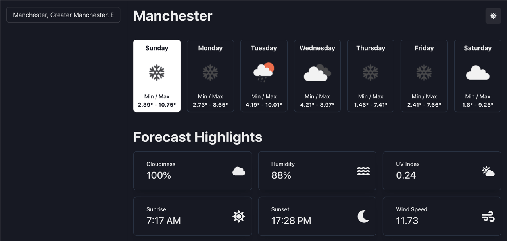

# Forecaster

Retrieve weekly forecasts for a given location.

## Features

- Built using React (Vite, Chakra UI and hooks)
- Light and dark mode
- Address autocomplete
- Retrieve weekly forecast
- Forecast highlights (cloudiness, humidity, uv index, sunrise, sunset and wind speed)

## Installation

1. Clone the repository from GitHub
2. Install dependencies `yarn`
3. Create .env file `cp .env.example .env`
4. Populate API keys
5. Run development server `yarn dev`

**Obtain API keys**

- [OpenWeatherMap API](https://openweathermap.org/appid)
- [Geoapify](https://www.geoapify.com/maps-api)

## Screenshot

